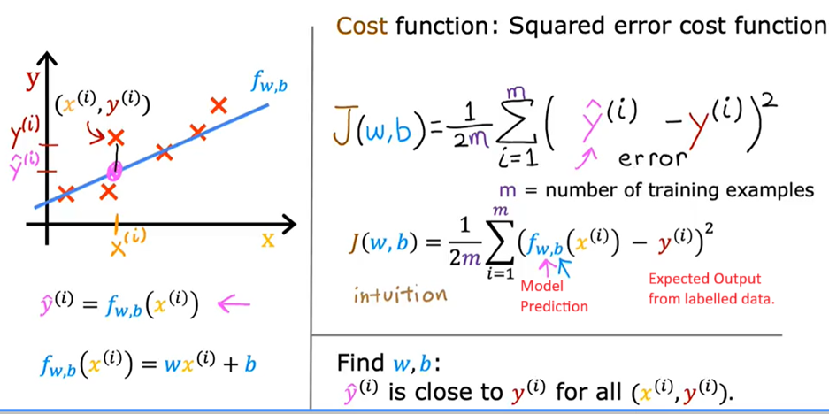

# Machine Learning Notes (Corsera)

Notes from the Machine learning lectures on Couresera

## What is Machine Learning

Machine Learning is a science that give machines the ability to learn without being explicitly programmed.

Examples:

- Spam filtering in the Email (Supervised Learning --> Classification)
- Netflix Movie suggestions, Amazon Product Recommendations (Recommender Systems)
- Facebook tagging images (Supervised Learning)
- Price Prediction for the properties in a viscinity.
- Gaming: Chess, Go,

## Types of Machine Learning Model

- Supervised Machine Learning: (Uses Labelled Data)
  - Used in most of the real-world applications. Seen most rapid advancement.
- Unsupervised Learning:
- Recommender Systems
- Reinforcement Learning

### **Supervised Learning**

Here the algorithm is built using labelled data. The data contains the output Y for given X. Then for give X value, the algorithm predicts value Y.

- The algorithm take in some examples to learn from and from these right answers the algorithm learns and give the reasonable prediction.
  - Example:
    - X = Email, Y = Spam/Not Spam
    - Online Advertising algorithm decides the advertisement that you are most likely to click on.
    - Identifying dent/scratch on the finished product. (Can be used in Indian Oil)
    - House Price Prediction Algorithm:
      - Labelled data of the prices of the house against the area. Now predict the price of the house based on the area.
      - Regression: It involves **predicting a number from infinite possible values.**

#### Types of Supervised Learning:

1. **Regression:** It involves predicting a number from infinitely many possible values.
    - Example: Market Share Prediction, House Price Prediction etc.
2. **Classification:**
  - Example:
    - Whether a picture is that of a cat or a dog.
    - Breast cancer detection falls in this category.
      - The ML Algorithm taken a labelled data set of past diagnosis and then it tries to predict if a lump is malignant or benign.
      - X axis will have the size of tumour and they Y axis will have 0-benign or 1-malignant.
    - It is different from Regression because the **possible output is from a small limited, finite possible values**.

### **Unsupervised Learning:**

In these algorithm, the data comes with inputs x, but not output y. Algorithm has to find structure in the data.

The following are the types of the Unsupervised Learning Algorithms:
1.  **Clustering Algorithms**
    - In unsupervised learning we are given data X that is not associated with output data Y. It take data without labels and groups them into clusters.
        - Example: Here the job is to find structure of pattern in the Data.
        - Example: **Lubes Customer Segmentation** Use Case
        - Example: **Google news** clusters similar news in a category. (Google News)
2. **Anomaly Detection**
    - It is used to find unusula data points.
    - Example: Fraud detection, LPG Diversion

3. **Dimensionality Reduction**
    - It compresses data using a fewer numbers without losing any information.

## Terminology

1. **Training Set**: The dataset used to train the model is called trainign set. It is used to train the model. 
    - The standard notation to denote the input is **lower case x.**
    - **x is Input Variable/Feature/Input Feature**. e.g. Size of house.
    - **y is Output Variable/Target Variable**. e.g Selling price of house.
    - **m denotes total number of trainng example**

A single training example can be denoted by (x, y)

Flow:
Training Set --> Goes to Learning Algorithm --> It produces Function f (that is hypothesis/fuction) --> f taken in a new input x and predicts ŷ (y-hat is the prediction of y)

x = Input Feature
f = Model
y = Actual true value of y
ŷ = Prediction 

#### Linear Regression is represented as follows:
f(x) = wx + b.

Here `w` is weight and `b` is bias. 
These are the parameters that can be adjusted to improve the model. They are sometimes called coefficients or weights.

It represents linear regression with one variable.

## **Cost Function**
Cost function will tell us how well the model is doing. Using this we can improve model. The objective is to bring the cost to minimum.

`The objective is to find the values of w and b that fits the data best. It means the resulting line is passing through somewhere close to all the points.`

Sum(`(ŷ - y)^2`)/2m for  = Avg. Squared Error
By convention cost function divides by 2 to make our calculations neater.

